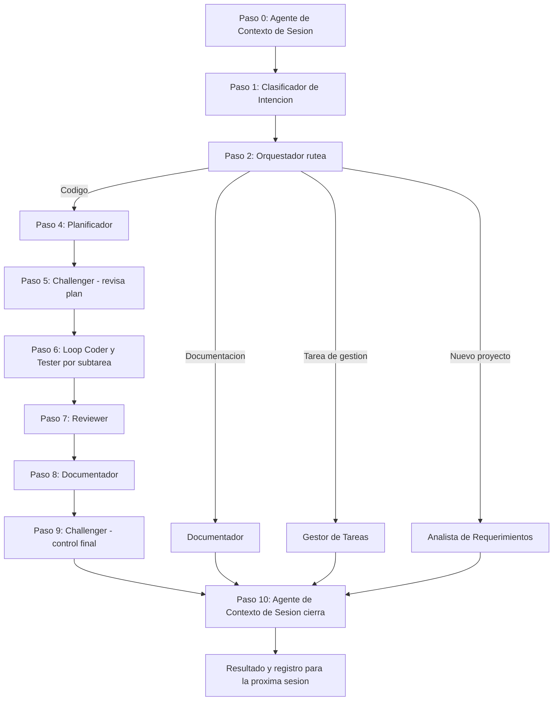

# Spec: Orquestador Claude Code con Observabilidad OpenTelemetry

Sep 24, 2026 · @Diego Morales

## Resumen y objetivos

Este proyecto tiene dos objetivos complementarios: dar observabilidad completa al flujo de trabajo de Claude Code operando como agente orquestador que delega tareas en subagentes especializados, y construir el harness que efectivamente ejecute ese flujo tal como fue definido, en vez de dejar la secuencia librada al criterio del modelo turno a turno.

Objetivo de observabilidad: poder visualizar el origen y destino de cada tarea, rastrear que acciones ejecuta cada subagente, y entender tiempos, costos y jerarquia de llamadas. La solucion se basa en OpenTelemetry, el estandar de la industria para trazas, metricas y logs, elegido por ser mas robusto y escalable que una integracion via hooks, ideal para un perfil full stack que puede operar infraestructura propia.

Objetivo de ejecucion: construir el harness, el programa que efectivamente conduce el loop de orquestacion, decidiendo de forma deterministica cuando se llama a cada agente, con que input, y que hacer con su output, en vez de dejar esa decision en el criterio del modelo en cada turno. Esto ataca directamente el problema actual: el flujo no se respeta a cabalidad cuando su cumplimiento depende solo de que el orquestador interprete bien una instruccion.

Objetivos concretos:

1. Habilitar la telemetria nativa de Claude Code (logs y metricas via OTLP).
2. Desplegar un colector de OpenTelemetry local que reciba, filtre y reenvie los datos.
3. Conectar el colector a un backend de visualizacion (SigNoz o Langfuse) para ver el flujo end to end.
4. Definir un flujo de ejemplo con un orquestador y subagentes especializados, documentando sus funciones.
5. Construir el harness de ejecucion que fuerce el cumplimiento del flujo definido, evaluando Dynamic Workflows de Claude Code y el Claude Agent SDK como opciones.

## Arquitectura

La arquitectura tiene tres capas: Claude Code emitiendo telemetria, un colector de OpenTelemetry intermedio, y un backend de visualizacion.

| Componente | Rol | Tecnologia sugerida |
| --- | --- | --- |
| Claude Code | Genera logs y metricas de cada sesion, herramienta y subagente | CLI nativo con variables de entorno OTEL |
| Colector | Recibe OTLP, filtra datos sensibles, enriquece con metadata, reenvia | OpenTelemetry Collector (contenedor local) |
| Backend | Almacena y visualiza trazas, metricas y jerarquia de agentes | SigNoz (self hosted) o Langfuse |

Nota importante: Claude Code exporta logs y metricas, pero no trazas en el sentido estricto de OpenTelemetry. Para reconstruir el arbol de llamadas entre orquestador y subagentes hace falta un puente que interprete los eventos de log y los convierta en spans, o usar un backend que soporte ese modelo de logs correlacionados.

Variables de entorno clave:

- CLAUDE\_CODE\_ENABLE\_TELEMETRY igual a 1, activa la exportacion.
- OTEL\_METRICS\_EXPORTER y OTEL\_LOGS\_EXPORTER en formato otlp.
- OTEL\_EXPORTER\_OTLP\_PROTOCOL, normalmente http slash protobuf o grpc.
- OTEL\_EXPORTER\_OTLP\_ENDPOINT, apuntando al colector local o al backend en la nube.
- OTEL\_EXPORTER\_OTLP\_HEADERS, para autenticacion contra el backend.
- OTEL\_METRIC\_EXPORT\_INTERVAL y OTEL\_LOGS\_EXPORT\_INTERVAL, en milisegundos, para controlar la frecuencia de envio.
- OTEL\_LOG\_USER\_PROMPTS, opcional, incluye el texto de los prompts en los logs, usar con cuidado por privacidad.

## Pasos de configuracion

1. Instalar Claude Code y confirmar version actualizada compatible con telemetria OTEL.
2. Levantar un OpenTelemetry Collector local, por ejemplo via contenedor Docker, con un archivo de configuracion que defina receptor OTLP y exportador hacia el backend elegido.
3. Crear el archivo de configuracion del proyecto en punto claude slash settings punto json, con el bloque env conteniendo las variables CLAUDE\_CODE\_ENABLE\_TELEMETRY, OTEL\_METRICS\_EXPORTER, OTEL\_LOGS\_EXPORTER, OTEL\_EXPORTER\_OTLP\_PROTOCOL y OTEL\_EXPORTER\_OTLP\_ENDPOINT apuntando al colector local, normalmente en el puerto 4318 para http o 4317 para grpc.
4. Configurar el backend de visualizacion: si es SigNoz, crear cuenta o instancia self hosted y obtener la clave de ingestion; si es Langfuse, generar las credenciales publicas y privadas y armar el header de autorizacion basico.
5. Definir los subagentes de Claude Code como archivos de configuracion independientes, cada uno con su rol, herramientas permitidas y descripcion de responsabilidad.
6. Ejecutar una sesion de prueba del orquestador delegando una tarea simple a un subagente, y verificar que los eventos lleguen al colector con el comando de verificacion de salud.
7. Validar en el backend que se puede reconstruir la jerarquia: sesion principal, delegacion, ejecucion del subagente y retorno del resultado.
8. Ajustar filtros de privacidad en el colector antes de usar el sistema con datos reales, especialmente si se activa el registro de prompts de usuario.

## Flujo de ejemplo (version 1, aprobada)

Caso de uso: el usuario hace un pedido en lenguaje natural relacionado a desarrollo o planificacion de software. El flujo incorpora control de sesion heredada, clasificacion de intencion, ejecucion en loop para tareas grandes, y dos capas de control de calidad, Challenger y Reviewer, en puntos especificos.

Pasos numerados con el agente responsable:

1. Agente de Contexto de Sesion y Repositorio: revisa si hay trabajo heredado de una sesion anterior (repositorio, avances previos) y arma el estado inicial antes de cualquier otra accion.
2. Subagente Clasificador de Intencion: recibe el pedido del usuario, ya con el contexto de sesion disponible, y determina la categoria: requerimiento de codigo, documentacion, tarea especifica de gestion, o toma de requerimientos de un proyecto nuevo.
3. Orquestador: rutea el pedido segun la categoria detectada hacia la rama correspondiente.

Rama de requerimiento de codigo (la mas completa):

4. Subagente Planificador: arma el plan tecnico, dividiendolo en subtareas mas chicas cuando el objetivo es grande. Ademas clasifica cada subtarea en un nivel de complejidad, bajo, medio o alto, y ese nivel se incluye en el objeto de delegacion para que el subagente ejecutor use el modelo mas adecuado, evitando sobre exigir un modelo grande en una tarea simple. Mapeo sugerido: complejidad baja usa el alias de modelo haiku, complejidad media usa sonnet, y complejidad alta usa opus.
5. Subagente Challenger (primera aparicion): cuestiona y pone a prueba el plan antes de que arranque la ejecucion.
6. Subagentes Coder y Tester, en loop: ejecutan subtarea por subtarea, el Coder implementa y el Tester prueba cada una, repitiendo el ciclo hasta que todas las subtareas del plan quedan completadas. Este loop sigue el patron de iterar hasta agotar el trabajo pendiente, evitando que el orquestador cargue el detalle de cada ciclo en su propio contexto.
7. Subagente Reviewer: revisa en conjunto el trabajo del Coder y el Tester una vez terminado el loop, verificando que cumple lo pedido.
8. Subagente Documentador: actualiza la documentacion tecnica de lo implementado.
9. Subagente Challenger (segunda aparicion): control final de calidad sobre el resultado completo antes de la entrega.
10. Agente de Contexto de Sesion y Repositorio: cierra la sesion dejando un registro del avance, y si el trabajo no quedo terminado, deja anotado con que continuar en la proxima sesion.

Ramas mas cortas (documentacion, tarea de gestion, toma de requerimientos) siguen el mismo paso cero, uno, dos y luego van directo a su subagente correspondiente (Documentador, Gestor de Tareas, o Analista de Requerimientos), cerrando igual con el Agente de Contexto de Sesion al final.



En la plataforma de observabilidad, la traza raiz arranca con el span del Agente de Contexto de Sesion y cierra con su mismo span de cierre, permitiendo ver la sesion completa de punta a punta, incluyendo cuantas iteraciones tomo el loop de Coder y Tester y en que paso intervino el Challenger o el Reviewer.

## Roles y funcionalidades de cada subagente

| Subagente | Responsabilidad | Herramientas tipicas | Entrada que recibe | Salida que devuelve |
| --- | --- | --- | --- | --- |
| Planificador | Descompone el pedido en pasos tecnicos concretos y define el orden de trabajo | Lectura de codigo, busqueda en el repositorio | Descripcion de la funcionalidad pedida por el usuario | Lista de pasos y archivos a modificar |
| Coder | Implementa el codigo siguiendo el plan, respetando convenciones del proyecto | Edicion de archivos, ejecucion de comandos | Plan de pasos del Planificador | Codigo modificado o creado |
| Tester | Escribe y corre pruebas automatizadas sobre el codigo nuevo | Ejecucion de tests, lectura de resultados | Codigo entregado por el Coder | Reporte de pruebas, pasa o falla |
| Documentador | Redacta o actualiza la documentacion tecnica de la funcionalidad | Edicion de archivos markdown | Codigo final validado por el Tester | Documentacion actualizada |

Cada subagente opera con contexto aislado, recibe solo lo que necesita del orquestador y devuelve un resumen, nunca el detalle completo de su proceso interno, lo cual mantiene el consumo de tokens bajo control. El orquestador es el unico que mantiene visibilidad del estado global de la tarea, y es tambien el punto donde conviene concentrar las reglas de permisos y las herramientas autorizadas para evitar que un subagente ejecute acciones fuera de su responsabilidad.

## Objeto estandarizado de delegacion y salida

Para evitar que el contexto del Orquestador crezca indefinidamente y para poder correlacionar cada paso con Open Telemetry, cada subagente recibe y devuelve informacion en un objeto estructurado, nunca texto libre completo.

Campos del objeto:

| Campo | Descripcion |
| --- | --- |
| trace id | Identificador de la traza raiz de la sesion, para correlacionar todos los pasos en Open Telemetry |
| span id | Identificador del paso puntual dentro de esa traza |
| parent span id | Identificador del paso que lo origino, para reconstruir la jerarquia |
| agente | Nombre del subagente responsable, por ejemplo Planificador, Coder, Reviewer |
| paso del flujo | Numero de paso segun la version aprobada del flujo |
| complejidad | Nivel bajo, medio o alto, asignado por el Planificador a la subtarea |
| modelo asignado | Alias de modelo usado segun la complejidad, haiku, sonnet u opus |
| estado | Completado, fallido, o necesita intervencion |
| input resumido | Resumen breve de lo que recibio el subagente, no el contenido completo |
| output resumido | Resumen breve de lo que devuelve el subagente |
| artefactos | Lista de referencias a archivos o recursos generados, nunca el contenido completo embebido |
| timestamp inicio | Momento en que el subagente comenzo a trabajar |
| timestamp fin | Momento en que el subagente termino |

El Orquestador es quien decide el siguiente paso esperado en base a este objeto, nunca el subagente. Este mismo objeto es la base para poblar los spans en la plataforma de observabilidad, de modo que cada campo tiene una correspondencia directa con un atributo de traza o metrica, lo cual ademas ayuda a detectar cuando el flujo no se esta respetando, por ejemplo si un subagente devuelve un estado que no corresponde al paso esperado por el Orquestador.

## Como se materializa el flujo: subagentes + workflow

Definir el flujo en una descripcion o en CLAUDE.md no alcanza para que se respete a cabalidad, porque en el modo turno a turno el orquestador decide que hacer despues basandose en su propio criterio en cada paso, y ahi es donde el flujo se puede desviar. Claude Code ofrece tres capas de definicion, y la que realmente fuerza el cumplimiento del paso a paso es la tercera.

**Capa 1, subagentes (.claude/agents/\*.md)**: definen el quien. Cada archivo Markdown con frontmatter YAML declara nombre, descripcion, herramientas permitidas y modelo. Cubre Planificador, Coder, Tester, Reviewer, Challenger, Documentador, etc. como entidades reutilizables, pero no define el orden entre ellos.

**Capa 2, CLAUDE.md o prompt**: instrucciones en texto libre que el orquestador tiene en cuenta pero puede desviarse, olvidar un paso, o saltarse un control de calidad. Es la capa mas debil y la mas probable causa del problema actual de que el flujo no se respeta.

**Capa 3, Dynamic Workflows (.claude/workflows/\*.js)**: esta es la capa que resuelve el problema de raiz. La diferencia arquitectonica clave es que el plan deja de vivir en la cabeza del orquestador (su ventana de contexto, decidiendo turno a turno) y pasa a vivir en codigo: un script JavaScript con primitivas agent(), pipeline(), parallel() y phase() que un runtime ejecuta de forma deterministica en segundo plano. El orquestador ya no decide libremente el siguiente paso, el script lo fuerza.

Esqueleto del workflow aplicado a los diez pasos definidos en este documento:

```javascript
// .claude/workflows/flujo-principal.js (esquema)
workflow(async ({ agent, phase, pipeline }) => {
  const contexto = await agent("contexto-sesion", { task: "revisar estado heredado" });
  const clasificacion = await agent("clasificador-intencion", { input: contexto });

  if (clasificacion.categoria === "codigo") {
    await phase("rama-codigo", async () => {
      const plan = await agent("planificador", { input: clasificacion });
      const revisado = await agent("challenger", { input: plan, modo: "revisar-plan" });

      // loop until dry sobre las subtareas del plan
      for (const subtarea of revisado.subtareas) {
        await pipeline([
          () => agent("coder", { input: subtarea, model: subtarea.modeloAsignado }),
          () => agent("tester", { input: subtarea, model: subtarea.modeloAsignado }),
        ]);
      }

      await agent("reviewer", {});
      await agent("documentador", {});
      await agent("challenger", { modo: "control-final" });
    });
  }
  // ramas de documentacion, tarea de gestion y toma de requerimientos siguen el mismo patron

  await agent("contexto-sesion", { task: "cerrar y registrar avance" });
});
```

Lo mas relevante para este proyecto es que estas primitivas soportan schema binding: el objeto estandarizado de doce campos definido en la seccion anterior (trace id, agente, complejidad, modelo asignado, estado, etc.) puede atarse como el contrato de entrada y salida de cada llamada a agent(). Esto da dos cosas a la vez: enforcement real del flujo, ya que el script no avanza al paso siguiente si el anterior no devolvio lo esperado, en vez de confiar en que el subagente se porte bien; y una correspondencia directa entre cada llamada agent() y un span en la plataforma de observabilidad.

Como capa complementaria, no sustituta, los hooks (PreToolUse y PostToolUse) sirven para detectar en tiempo real si un subagente intenta ejecutar algo fuera de lo que su paso del flujo permite, como una red de seguridad adicional sobre el script.

Una vez que el workflow corre bien una vez, se puede guardar como slash command (comando /workflows, seleccionar la corrida, tecla s) para que sea repetible sin reescribirlo cada vez.

## Harness de ejecucion: Dynamic Workflows vs Claude Agent SDK

Observar el flujo con OpenTelemetry no garantiza que el flujo efectivamente ocurra como fue definido. Para eso hace falta un harness: el programa que contiene y conduce el loop de orquestacion, decidiendo cuando se llama a cada agente y que hacer con su resultado. Se evaluaron dos opciones para construirlo.

**Opcion A, Dynamic Workflows (dentro de Claude Code)**: ya descripta en la seccion anterior como Capa 3. Ventaja: no requiere infraestructura propia y se adopta rapido. Limitacion: el script de orquestacion lo escribe el propio Claude Code en el momento, por lo que el cumplimiento del flujo sigue dependiendo de que el modelo interprete bien el pedido para generar el script correcto cada vez. Ademas requiere plan pago o acceso a la API, y a la fecha de este documento la funcionalidad esta en research preview.

**Opcion B, Claude Agent SDK (harness propio)**: es la misma libreria que usa Claude Code por dentro (loop de agente, herramientas, subagentes, hooks, sesiones), empaquetada para embeber en una aplicacion propia en Python o TypeScript. La diferencia clave es que el loop de orquestacion pasa a ser codigo propio en vez de una decision del modelo: la secuencia de los diez pasos del flujo se implementa como control de flujo real (if, for) en la aplicacion, y el modelo solo se invoca para ejecutar cada paso puntual cuando el harness lo llama. Esto da control deterministico sobre la secuencia, algo que ni el prompt ni el workflow autogenerado garantizan del todo.

Beneficio adicional para este proyecto: existe instrumentacion de OpenTelemetry nativa para el Agent SDK (paquetes como traceai-claude-agent-sdk, o plataformas como Laminar) que generan spans automaticos por conversacion, por turno, por tool call y por subagente con jerarquia padre-hijo correcta. Esto resuelve de raiz la limitacion anotada en la seccion de Arquitectura, donde Claude Code CLI exporta logs y metricas pero no trazas estrictas y hace falta un puente: con el Agent SDK las trazas nacen ya como trazas.

**Recomendacion**: construir el harness de ejecucion con el Claude Agent SDK como nucleo, dado el perfil full stack del equipo y la necesidad de control deterministico sobre el flujo de diez pasos. Dynamic Workflows queda como opcion secundaria mas liviana, util para escenarios donde no se quiera mantener infraestructura propia o para prototipar el flujo antes de invertir en el harness.
